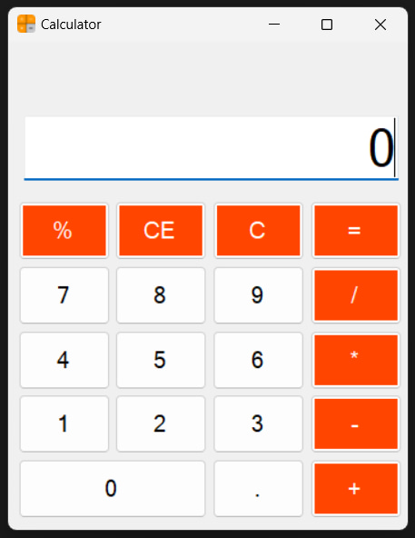

# 🖩 C# Windows Forms Kalkulyator

Bu **C# Windows Forms** yordamida yaratilgan oddiy **Kalkulyator** dasturi. U foydalanuvchilarga asosiy arifmetik amallarni bajarish imkonini beradi: qo‘shish, ayirish, ko‘paytirish, bo‘lish va qoldiqni hisoblash.

## 🚀 Xususiyatlari

- 🖩 Asosiy arifmetik amallar: `+`, `-`, `*`, `/`, `%`
- 🏗️ Tozalash (`C`) va oxirgi kiritilgan raqamni o‘chirish (`CE`) tugmalari
- 🔢 O‘nli kasrlar bilan ishlash imkoniyati
- 📱 Foydalanuvchi uchun qulay interfeys
- 🎨 Chiroyli va intuitiv dizayn

## 🛠️ Texnologiyalar


- **C#**
- **Windows Forms (WinForms)**
- **Visual Studio**

## 📸 Skrinshot



## ⚙️ O‘rnatish va Ishga Tushirish

1. **Loyihani klonlash**  
   ```sh
   git clone https://github.com/jasurhaydarovcode/Calculator-CSharp.git
